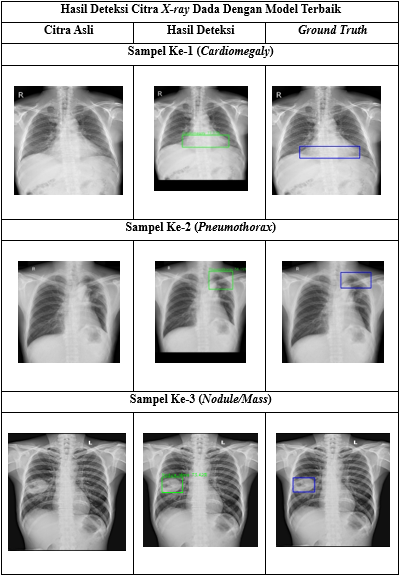

# 🩻 Skripsi: Implementasi Metode YOLOX untuk Deteksi Abnormalitas pada Citra X-Ray Dada

---

## 📘 Deskripsi

Proyek ini merupakan bagian dari **Skripsi** berjudul  
> **“Implementasi Metode YOLOX untuk Deteksi Abnormalitas pada Citra X-Ray Dada”**  
oleh **Siti Nur Aini (210411100054)**  
Program Studi **Teknik Informatika, Universitas Trunojoyo Madura (2025)**  

Penelitian ini mengimplementasikan **algoritma YOLOX (You Only Look Once – Extended)** untuk mendeteksi kelainan pada **citra X-ray dada** secara otomatis.  
Tujuan utamanya adalah meningkatkan efisiensi dan akurasi dalam identifikasi penyakit paru menggunakan pendekatan *object detection* berbasis deep learning.

---

## 🧠 Metodologi

### 🔹 Dataset
- Jumlah citra: **1170 gambar X-ray dada**
- Resolusi: **512×512 px** dan **1024×1024 px**
- Format anotasi: `xmin`, `ymin`, `xmax`, `ymax` (bounding box)
- Data dibagi menjadi:
  - **Training set**
  - **Validation set**
  - **Testing set**

### 🔹 Tahapan Penelitian
1. **Preprocessing Data**
   - Konversi ukuran dan format anotasi (CSV → XML)
   - Reduksi jumlah citra yang berlebihan
2. **Splitting Data**
   - Pembagian dataset menjadi *train*, *test*, dan *validation*
3. **Training Model**
   - Framework: PyTorch  
   - Hyperparameter:
     - `batch_size`: 16  
     - `optimizer`: SGD  
     - `learning_rate`: 1e-3  
     - `loss_function`: YOLO Loss  
4. **Testing & Evaluation**
   - Evaluasi menggunakan **Mean Average Precision (mAP)**
   - IoU threshold: 0.5 dan 0.5:0.95  

---

## 🧩 Skenario Uji Coba

Empat skenario pelatihan dilakukan untuk membandingkan performa model berdasarkan kombinasi parameter yang berbeda.  
Evaluasi dilakukan pada data *training* dan *testing* untuk memperoleh tingkat akurasi dan *precision-recall curve* terbaik.

---

## 📊 Hasil dan Analisis

- Model **YOLOX** berhasil mendeteksi area abnormalitas pada X-ray dada dengan tingkat akurasi tinggi.  
- Evaluasi menggunakan **mAP@0.5** menunjukkan hasil yang memuaskan untuk klasifikasi area paru abnormal.  
- Deteksi bekerja efektif dalam mengenali variasi ukuran, bentuk, dan posisi area kelainan.

---

## 🖼️ Hasil Deteksi

Berikut adalah contoh hasil deteksi area abnormalitas pada citra X-ray dada:

### ✅ Hasil Deteksi 

Bounding box berwarna menunjukkan area yang terdeteksi sebagai abnormalitas dengan label penyakit yang dihasilkan oleh model YOLOX.

---

## ⚙️ Teknologi yang Digunakan

| Komponen | Teknologi |
|-----------|------------|
| Bahasa Pemrograman | Python |
| Framework | PyTorch |
| Model Deteksi | YOLOX |
| Dataset | X-ray Dada (Custom Labeled) |
| Evaluasi | Mean Average Precision (mAP) |
| Tools | Google Colab, LabelImg, Pandas, NumPy, Matplotlib |

---

## 📚 Kesimpulan

- **YOLOX** efektif dalam mendeteksi abnormalitas pada citra X-ray dada dengan akurasi tinggi.  
- Model mampu mengidentifikasi area kelainan paru-paru secara otomatis dan efisien.  
- Hasil ini dapat menjadi dasar pengembangan sistem pendukung diagnosis medis berbasis AI.  

---

## 👩‍💻 Penulis
**Siti Nur Aini**  
`210411100054`  
Program Studi Teknik Informatika  
Universitas Trunojoyo Madura, 2025  

---

## 📎 Lisensi
Proyek ini dibuat untuk tujuan akademik dan penelitian.  
Hak cipta © 2025 – Universitas Trunojoyo Madura.

